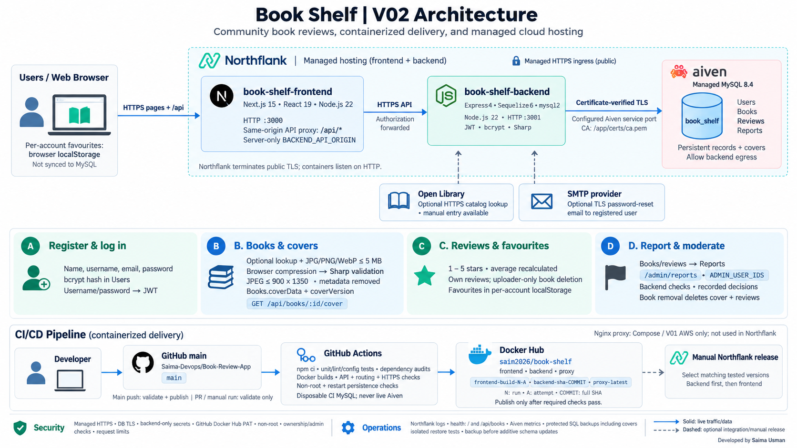

# Book Shelf - a '3-Tier' Book Review Web Application

Developed and maintained by **Saima Usman**.

Book Shelf is a community book-review application for discovering titles, sharing
synopses, writing reviews, and keeping a personal favourites collection.

## Features

- Register with a name, username, email, and password; log in with username and password.
- Search books by title or author and sort the collection by title or rating.
- Add a book with title, author, synopsis, and an optional initial rating.
- Upload an optional book cover with a preview window; covers persist with the book.
- Look up titles and descriptions through Open Library, with editable results and manual entry.
- Delete only books uploaded by the signed-in account.
- Write 1-5 star reviews and edit or delete personal reviews.
- Recalculate average ratings when reviews change.
- Save favourites while signed in, separately for each account in the current browser.
- Report inappropriate books or reviews for administrator review.
- Moderate reports, dismiss concerns, or remove content with recorded decisions.
- Recover passwords by email when an administrator configures SMTP delivery.
- Use responsive pages, sticky navigation, and a back-to-top control.

Adding a book submits catalog information and an optional cover; it does not upload
an ebook or audio file. See [book covers](docs/14-book-covers.md) for image limits.
Catalog lookup is not AI generation. Favourites are browser-local
and do not synchronize between devices or appear in database backups.

## Technology

| Layer | Stack |
| --- | --- |
| Frontend | Next.js 15 App Router, React 19, Tailwind CSS 4, CSS, Axios, Lucide icons |
| Backend | Node.js 22, Express 4, Sequelize 6, mysql2, Sharp image processing |
| Data | MySQL 8.4; Users, Books, Reviews, and Reports |
| Authentication | JWT sessions, bcrypt password hashes, session invalidation after password resets |
| Email | Nodemailer with certificate-verified SMTP |
| Delivery | GitHub Actions, Docker Hub, Docker Compose v2 |
| Managed hosting | Northflank application services and Aiven MySQL |
| Optional infrastructure | Terraform, Ansible, AWS EC2, Nginx |

Dependency versions are pinned in the application manifests and lockfiles.

## Overll Architecture 



## Quick Start: Local Docker Compose

Requirements: Git, Docker Engine/Desktop, Docker Compose v2, and OpenSSL.

```bash
git clone https://github.com/Saima-Devops/Book-Review-App.git
cd Book-Review-App
cp .env.example .env
chmod 600 .env
```

Edit the root `.env`: set `PUBLIC_URL=http://localhost`, retain the database/user
names, and replace all password/JWT placeholders with distinct secrets generated
using `openssl rand -hex 32`. Leave `ADMIN_USER_IDS` empty until an administrator
account has been identified. Keep this file outside version control.

```bash
docker compose config --quiet
docker compose up -d --build --wait --wait-timeout 600
docker compose ps
PUBLIC_URL=http://localhost bash scripts/verify.sh
```

Open [Book Shelf locally](http://localhost). Nginx publishes port 80 and routes
`/api/*` to the private backend. Frontend port 3000, backend port 3001, and MySQL
port 3306 are not published by Compose. The database volume defaults to
`reading-room_db_data`; retained infrastructure names are compatibility identifiers,
not the application brand.

HTTP localhost is for development. Public deployments require HTTPS.
Initial sample books are added only when Books and Reports are both empty.

```bash
docker compose logs --tail=100 backend frontend database reverse-proxy
docker compose down
```

Routine shutdown preserves data. **Do not use `docker compose down -v` on a
database containing valuable records.** Changing environment passwords does not
rotate accounts in an already-initialized MySQL volume.

## Managed Deployment

The primary managed deployment uses two Northflank services and Aiven MySQL:

```text
Browser --HTTPS--> Next.js frontend --HTTPS--> Express backend --verified TLS--> MySQL
                         /api/* proxy
```

Published images share the [saim2026/book-shelf Docker Hub repository](https://hub.docker.com/r/saim2026/book-shelf).
Select matching `frontend-build-RUN-ATTEMPT` and `backend-build-RUN-ATTEMPT` tags,
or recorded digests. `frontend-latest` and `backend-latest` are moving aliases.
The optional `proxy-latest` image is for Compose, not the two-service managed deployment.

See the [installation guide](installation_guide.md) and
[Northflank/Aiven configuration](docs/10-northflank-aiven.md).
Publishing images does not automatically deploy them. SMTP and custom domains
are optional configurations, not enabled by default.

## Documentation

| Topic | Guide |
| --- | --- |
| Installation and releases | [Installation guide](installation_guide.md), [PDF edition](installation_guide.pdf) |
| Application use | [User guide](docs/12-user-guide.md) |
| Architecture | [Deployment architecture](docs/01-architecture.md) |
| Configuration | [Environment and ports](docs/02-env-and-ports.md) |
| Startup | [Health checks](docs/03-healthchecks-and-depends-on.md) |
| Routing | [Proxy routing and CORS](docs/04-proxy-routing-and-cors.md) |
| Data protection | [Backup and restore](docs/05-persistence-and-backup.md) |
| Logs and operations | [Logging](docs/06-logging.md), [Operations runbook](docs/07-operations-runbook.md) |
| Optional EC2 TLS | [IP certificate deployment](docs/08-ip-https.md) |
| CI and image publishing | [GitHub Actions](docs/09-github-ci.md) |
| Catalog and recovery | [Open Library](docs/book-catalog.md), [Password recovery](docs/password-recovery.md) |
| Moderation | [Content reporting](docs/11-content-moderation.md) |
| Production limitations | [Release readiness](docs/13-production-readiness.md) |

## Quality Checks

Requirements: Node.js 22, npm, Python 3, and the Docker Compose CLI.

```bash
npm --prefix backend ci
npm --prefix backend test
npm --prefix backend audit --audit-level=high
npm --prefix frontend ci
npm --prefix frontend run test:lint-glob
npm --prefix frontend run test:hosting
npm --prefix frontend run lint
npm --prefix frontend audit --audit-level=high
npm --prefix frontend run build
python3 -m unittest discover -s tests -v
git diff --check
```

Database integration and container/HTTPS tests run on a disposable GitHub Actions
stack. Never point write-enabled integration tests at a live database. npm audits
do not cover operating-system packages; container scanning is a separate release
control.

## Project Layout

```text
frontend/             Next.js application and runtime API proxy
backend/              Express routes, models, services, and tests
docs/                 User and operator documentation
tests/                Configuration and publishing tests
scripts/              Publishing, backup, verification, and deployment utilities
proxy/                Optional Compose Nginx configuration
infra/ and ansible/   Optional AWS provisioning and deployment
docker-compose.yml    Local/self-managed four-service stack
```

## Attribution

Book Shelf is developed and maintained by Saima Usman, building on the
[original Book Review App by Pravin Mishra](https://github.com/pravinmishraaws/book-review-app).
