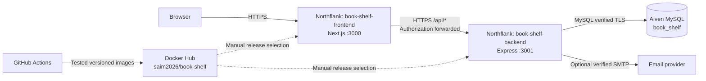
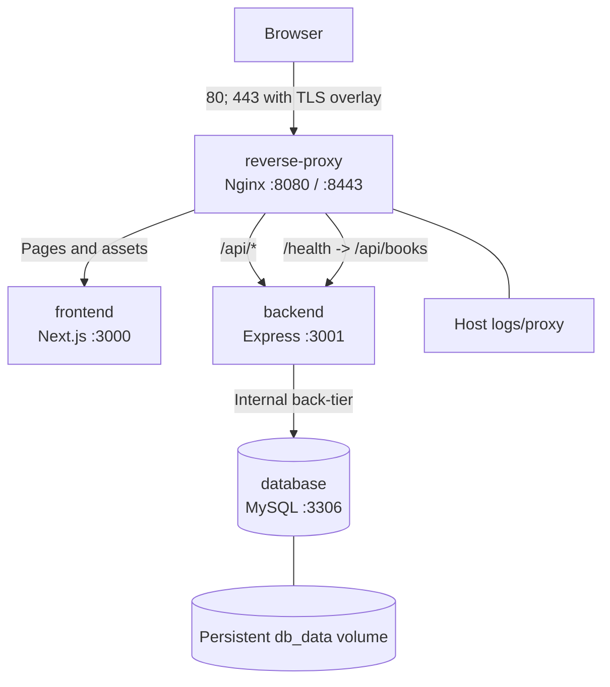

# Deployment Architecture

Maintainer: Saima Usman.

## Managed Hosting

Northflank terminates public HTTPS. Container networking remains HTTP. The
frontend forwards same-origin API requests using its server-only runtime
`BACKEND_API_ORIGIN`. Backend secrets are not shared with the frontend.
Aiven stores Users, Books, Reviews, and Reports. Favourites remain in browser
local storage.
Optional book covers are normalized JPEGs stored in Books, not on an ephemeral
container filesystem. The frontend serves them through the same API proxy.

## Docker Compose / Optional AWS EC2

Frontend/proxy use `front-tier`; backend uses both networks; database uses only
internal `back-tier`. Only Nginx publishes application ports. EC2 is an optional
single-host deployment using Ubuntu x86_64, not a prerequisite for managed hosting.
Retained `reading-room` names avoid replacing existing infrastructure and volumes.
Neither free hosting nor a single EC2 host provides application-level high availability.
