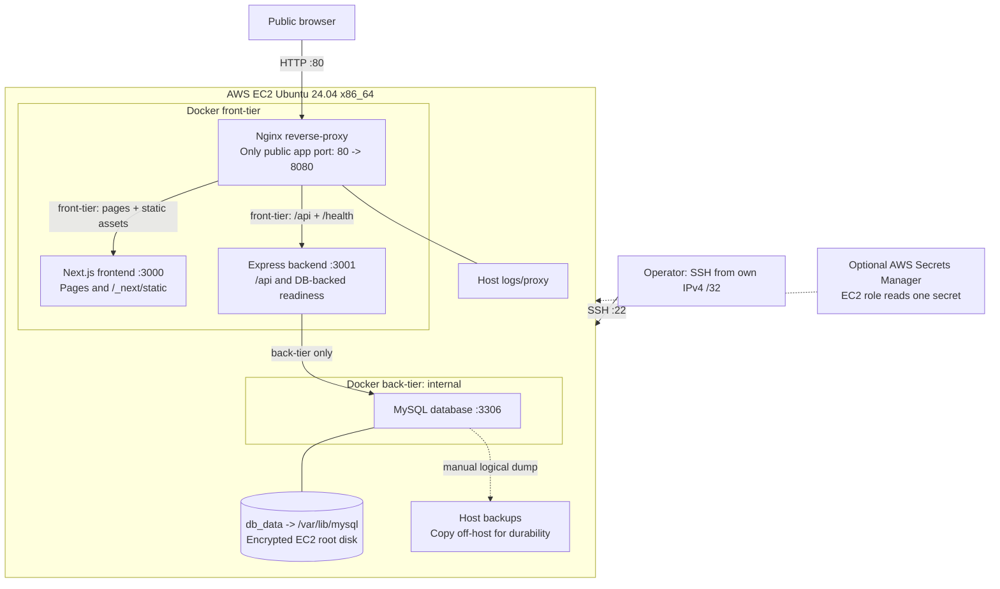

# Deployment architecture

This diagram describes the existing Reading Room repository, not the assignment's upstream sample app. Add the runtime FULL_NAME as a caption when capturing screenshot 2.

The proxy also belongs to front-tier; the backend belongs to both networks. The database belongs only to back-tier. No application/database host port is published. The EC2 security group permits only 22 from the selected /32 and 80 publicly.

Assignment adaptations: Next.js needs a server for dynamic book IDs and new uploads. A static-only Nginx frontend would require source changes and remove current behavior. The existing /api/books endpoint performs a database query and is exposed as /health at the proxy. No backend source endpoint was added.
